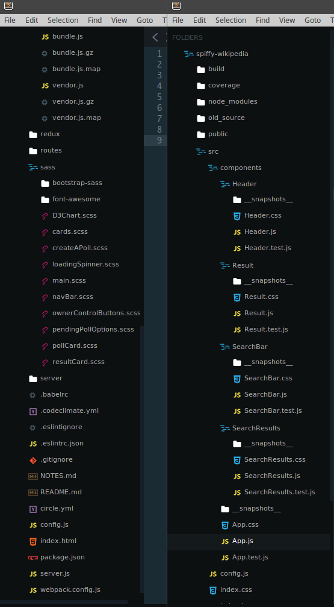

For the past few months, I've been working feverishly on my first full stack application challenge for Free Code Camp and it's finally [deployed](https://fcc-vote.matttrifilo.com)! You can view the source on [GitHub](https://github.com/itxchy/FCC-vote).

I took my time on this project in particular because while I was familiar with React, Express, and MongoDB at a basic level, I'd never used them together before to build a modern CRUD application. On top of that, I had no experience with Redux or the Flux patterns its based on, much less how to handle state in a large React/Redux application. This was also my first experience visualizing data with D3.js.

Needless to say, I've learned more from this project than anything else I've worked on to date, and I'm excited to share some of the most useful lessons I've learned.

<!-- MarkdownTOC -->

- [Thank You Virtual Mentors](#thank-you-virtual-mentors)
- [An Overview of Vote](#an-overview-of-vote)
- [Tooling](#tooling)
  - [Linting with Standard JS \(Use with caution\)](#linting-with-standard-js-use-with-caution)
    - [Why Standard \(or Semistandard\)?](#why-standard-or-semistandard)
    - [Using Standard Without React](#using-standard-without-react)
    - [Using Standard With React](#using-standard-with-react)
  - [Webpack 2](#webpack-2)
    - [Optimizing Your Bundle\(s\)](#optimizing-your-bundles)
      - [Analyzing a Bundle with `webpack-bundle-analyzer`](#analyzing-a-bundle-with-webpack-bundle-analyzer)
      - [Splitting Bundles](#splitting-bundles)
      - [Optimizing Bundles for Production](#optimizing-bundles-for-production)
    - [Tree-Shaking](#tree-shaking)
    - [Linting with Webpack](#linting-with-webpack)
      - [One Caveat](#one-caveat)
- [The Client](#the-client)
  - [React](#react)
    - [`React.createClass` vs ES6 classes](#reactcreateclass-vs-es6-classes)
    - [PropTypes](#proptypes)
    - [Component Hierarchy](#component-hierarchy)
      - [Spiffy Wikipedia Example](#spiffy-wikipedia-example)
  - [Redux](#redux)
    - [When Do You Need Redux?](#when-do-you-need-redux)
    - [A Ducks Pattern Variant](#a-ducks-pattern-variant)
    - [Thunks Middleware](#thunks-middleware)
  - [Styling](#styling)
- [The Server](#the-server)
  - [Server Side Rendering](#server-side-rendering)
      - [`React.createElement` Refresher](#reactcreateelement-refresher)
    - [Pre-Transpiling For Node Using Babel](#pre-transpiling-for-node-using-babel)
  - [Express API Routes](#express-api-routes)
    - [RESTful Dialog Between Machines](#restful-dialog-between-machines)
    - [CRUD Logic](#crud-logic)
    - [Avoiding Callback Hell With Async/Await](#avoiding-callback-hell-with-asyncawait)
      - [Not So Fast...](#not-so-fast)
- [The Database: MongoDB](#the-database-mongodb)
  - [Schema](#schema)
  - [mongoose](#mongoose)
  - [Development Database vs Production Database](#development-database-vs-production-database)
- [Production](#production)

<!-- /MarkdownTOC -->


# Thank You Virtual Mentors

First off, I'd like to thank Brian Holt for both of his great Complete Intro To React workshops on Front End Masters. The workflow he shared helped me to scaffold the guts of this project without endless refactors along the way as it grew. I can't recommend his workshops enough, even if you've been using React for years. The insights he shares are well worth the Front End Masters subscription. Check out all of Kyle Simpson's workshops while you're at it!

I'd also like to thank Rem Zolotykh for his great [Youtube series](https://www.youtube.com/playlist?list=PLuNEz8XtB51K-x3bwCC9uNM_cxXaiCcRY) about building a React/Redux application with jwt authentication. While you should never use a custom authentication strategy like this for real-world production apps (use Passport instead), it was valuable to learn about the authentication flow using JSON web tokens with localStorage, and managing headers. It was also great to get another perspective of how to wire up React and Redux.

Finally, I owe a great deal of gratitude to Robert M. Pirsig. While working on this project, I hit a lot of brick walls. To unwind after getting put in my place by a waterfall of error messages, I would read Zen and the Art of Motorcycle Maintenance. After picking at the first half for a year, I finished the second half during this project very quickly. Many of the metaphors and ideas discussed in that book correlate directly with programming. It put a lot of issues I had with code into a much broader perspective and it made me appreciate the Art of Programming much more deeply. It changed the way I percieve and approach bugs. I've gained an appreciation for them, as frustrating and ego-crushing as they can be. Each hard bug illumiates a gap in knowledge with an oppurtunity to learn something profound, and you grow because of it. In turn, this leads to writing better *quality* software naturally and becoming better prepared and energized to contribute fresh perspectives to open source software, and companies building the future. A bug may seem trivial at first, but if you consider that an entire application may rely on that trivial bug being fixed in order to run the way it needs to, it's not so trivial after all, and deserves attention and careful thought.

# An Overview of Vote

The user stories for this Free Code Camp project can be viewed [here](https://www.freecodecamp.com/challenges/build-a-voting-app).

Basically, Vote allows you to create polls as an authenticated user, vote on any poll, and share a single poll with friends and strangers.

This project is far from perfect. You can't search or sort polls, but the time spent adding too much functionality beyond the user stories for a toy app like this is better spent on new projects at this point. This app won't be a "Show HN" post. Learning the process and mechanics of building something like this was the primary goal, and it payed dividends in hard knocks.

Let's dig in!

# Tooling

If you're going to build a good table, you'd better know what tools to use when, why, and how. Otherwise your food will slide into your lap.

## Linting with Standard JS (Use with caution)

I was skeptical of [Standard JS](http://standardjs.com/) at first,
but I gave it a chance at the recommendation of Brian Holt from his workshop, and really enjoyed the simplicity.

A lot of [very](https://github.com/getify/You-Dont-Know-JS/blob/master/types%20&%20grammar/ch5.md#error-correction) [smart](http://www.2ality.com/2011/05/semicolon-insertion.html) [people](https://google.github.io/styleguide/javascriptguide.xml#Semicolons) assert (with good reason) that ommiting semi-colons, and relying on JavaScript's [Automatic Semicolon Insertion](https://www.ecma-international.org/ecma-262/5.1/#sec-7.9) to insert every semi-colon for you under the hood is a bad practice. They're right! It adds another aspect of risk for a company with deadlines if a team of developers are allowed to write code without semicolons, simply because of the added exposure to ASI-related bugs if any code isn't linted properly. Plus, you need to place your trust in the linter to catch every edge case.

That said, the common [gotchas](http://standardjs.com/rules.html#semicolons) of ommitting semi-colons are well known and Standard has lint rules to stop you from making those mistakes, assuming that all of your code is always linted. I think its fine for personal projects that aren't meant for customers.

It's safer to use [Semistandard](https://github.com/Flet/semistandard) (Standard plus semicolons) for customer facing code, and you still get all the benifits of a simple, effective style-guide that you don't need to spend time tweaking. You can't tweak it anyway.

### Why Standard (or Semistandard)?

Eslint is a powerful tool, but I'd spent more time than I'd like to admit experimenting with linting rules, and researching whether to use a popular style guide from companies like AirBnB and which one, plus managing `.eslintrc` changes accross projects.

Standard JS takes all of that choice out of the equation and enforces a simple, reliable styleguide that CAN'T be changed. If you change it with custom lint rules, than you're not coding in Standard.

This idea captures the brilliance of [PEP 8](https://www.python.org/dev/peps/pep-0008/) from Python. If you know PEP 8 well, you'll have an easy time reading other people's Python code. Standard seeks to offer the same consistancy for JavaScript.

While I don't think it would be good for JavaScript to officially standardize any single style guide for every developer to follow given its history, Standard offers a style guide for eslint that lets you set-it-and-forget-it, which frees up valuable brain cycles.

### Using Standard Without React

Standard itself is very easy to [install and use](https://github.com/feross/standard#install).

The docs are straightforward, but Standard's lint errors are hard to read in the terminal.

Instead of using Standard directly, you can install a package called `snazzy`, which will give you nicely formatted results with colors.

If you have a new project, here's what you can do:

Install:
```bash
$ yarn add -D snazzy
```

> If you already have standard installed globally, install `standard` as a dev dependency to work with snazzy in your project without errors:
`yarn add -D standard snazzy`. The smarties behind Yarn [discrourage](https://yarnpkg.com/en/docs/cli/add#toc-caveats) using global dependancies in most cases, so keep them local whenever possible for portability. NPM works just fine too if you're not into yarn.

Add a lint script to `package.json`:
```
"scripts": {
  "lint": "snazzy"
}
```

> If you're using `npm`, mute the annoying `err!` messages by adding `exit 0` to your script: `"lint": "snazzy; exit 0`

Run it:
```
$ yarn run lint
```

That's it! Standard will magically find your JavaScript (excluding `node_modules`) and return your lint errors, or nothing if everything passes.

### Using Standard With React

Using Standard with React will require an eslint config, but it's still very easy.

install:
```
$ yarn add -D eslint-config-standard eslint-config-standard-react eslint-plugin-promise eslint-plugin-react eslint-plugin-standard
```
> If you have `eslint` installed globally, add `eslint` to the above command so that your config points to the local copy of `eslint` in order to avoid errors.

Create a file called `.eslintrc` in your root directory and add this:
```
{
  "extends": ["standard", "standard-react"]
}
```

Add `eslint` and your source code directory to your lint script:
```
"scripts": {
  "lint": "eslint src"
}
```

Unlike `standard` or `snazzy`, you need to specify where eslint should look for your `.js` files. In the script above, eslint will check a directory called `src`

What if you use extensions like `.jsx` or `.es6`? `eslint` has a flag for that:
```
"scripts": {
  "lint": "eslint --ext .js --ext .jsx src"
}
```

The CLI has many more options depending on your needs. [The docs are great](http://eslint.org/docs/user-guide/command-line-interface).

Finally, run it:
```
yarn run lint
```

Happy linting!

You can also delegate linting to `webpack` using `eslint-loader`, so you'll see lint errors every time a new bundle is compiled. More on that in a bit.

I turned off linting in Sublime Text months ago because I found it more distracting then helpful. If you don't like linting in a terminal, Standard plugins are available for the major text editors.

## Webpack 2

In a nutshell, Webpack bundles up your website's assets into a single file to reduce http requests. This lets you import things (js, jpg's, css) into your JavaScript modules, and Webpack will bundle up everything smartly so it's all in the correct order.

Very recently, Webpack 2 was [finally released](https://medium.com/webpack/webpack-2-2-the-final-release-76c3d43bf144#.plxnf4o9g) and it's awesome!

They've made the [migration process](https://webpack.js.org/guides/migrating/) almost painless. Webpack 2 will validate your config for you, so you don't need `webpack-validator` anymore. If you mess something up, Webpack will give you a helpful error message of what doesn't match their API, and how you can fix it.

The [documentation](https://webpack.js.org/configuration/) is very well thought out and organized so I encourage you to check it out if you've never used Webpack before, or haven't upgraded from version 1.

While webpack seems to perform a basic task, files in -> bundle(s) out, its configuration can get complex depending on what you need it to do. The documentation for version 2 is thankfully much better than version 1, so go through the concepts and guides on [webpack.js.org](https://webpack.js.org/) if you don't know where to start. It will get you up and running in no time.

### Optimizing Your Bundle(s)

As your project grows, so will your bundle. It will probably get huge. The development version of Vote had a bundle that was over 3 MB before optimizing, but in production, it now has a `vendor.js` for larger dependencies, and a `bundle.js` for the app itself. Each bunlde weighs in under 200 kb minfied and gzipped. The main bundle can get broken up even furthur with [code spitting](https://webpack.js.org/guides/code-splitting/).

Before configuring the `vendor.js` bundle for Vote, I first had to figure out which dependencies were bulking up the `bundle.js` file the most.

#### Analyzing a Bundle with `webpack-bundle-analyzer`

One of the coolest plugins I've come across for Webpack is the [webpack-bundle-analyzer](https://www.npmjs.com/package/webpack-bundle-analyzer). It gives you a highly-interactive visualization of your bundle(s) to show you the elephants in the room.

It's as easy as installing:
```
$ yarn add -D webpack-bundle-analyzer
```

and including it with your plugins in your Webpack config:
```js
const BundleAnalyzerPlugin = require('webpack-bundle-analyzer').BundleAnalyzerPlugin

module.exports = {

// rest of config...

  plugins: {
    new BundleAnalyzerPlugin()
  }
}

```

Now, anytime you build a new bundle, `BundleAnalyzerPlugin` will spin up a server, and open your browser to a visualiztion of your bundle(s) and dependencies scaled to size. The plugin can take a config object as an argument, but the defaults should be just fine for most cases. The config options are in the [docs](https://github.com/th0r/webpack-bundle-analyzer). To "turn it off," you can simply comment out the plugin.

For Vote, I used this tool to determine which vendor dependencies should be extracted into a `vendor.js` bundle.

#### Splitting Bundles

A lot of quick wins can be gained by splitting up your bundle. To start, putting your 3rd party libraries in a `vendor.js` bundle will not only reduce the file size of the two, but you'll also be able to take advantage of caching the 3rd party dependencies that likely won't change nearly as often as your application's code. Your users would only need to download your bulky dependencies once, and have them ready to go immediatlely on future vists. Boom! Just be sure to include a [chunkHash](https://webpack.js.org/guides/caching/) with each bundle so that browsers won't serve old cached bundles after you deploy a new build.

The ideas for splitting up bundles can get [deep](https://survivejs.com/webpack/building/splitting-bundles/) very quickly, so split them up based on how you expect your app to grow.

Some great advice on how to shink down certain dependencies, and deal with multiple copies of dependencies with different versions can be found in [this great post](https://medium.freecodecamp.com/manually-tuning-webpack-builds-284923f47f44#.799l57uja).

You can take advantage of [code splitting](https://webpack.js.org/guides/code-splitting-import/) for your application code as well, so your users only need to download the nessessary code for each "page" of your single page app, instead of the whole thing at once.

For simplicity, I decided to add just the largest libraries to Vote's `vendor.js` bundle. `d3`, `jquery`, `react`, `react-dom` and `moment`.

Those dependencies alone made the main `bundle.js` much smaller, without an overly-large `vendor.js` file.

If you have a lot more dependencies and modules in a large application, you can spit up your bundles in many different ways, but in this case for Vote, I'm not going to spend the time code splitting further since this app is not getting any larger.

#### Optimizing Bundles for Production

Making Webpack 2 builds for [production](https://webpack.js.org/guides/production-build/) can be as easy as running `webpack -p`.

That one flag will minify your JavaScript with Webpack's `UglifyJsPlugin`, set all of your loaders' minimize option to `true`, and set the Node environment variable to `true` so your code's production optimizations can take effect.

That's very handy for many situations but for Vote, I wanted to gzip my JavaScript to shrink the bundles even furthur. That required a bit of config.

A quick way to cleanly create a production config file for webpack is to use `webpack-merge`. This allows you to combine a separate config file with your main config file to limit code duplication, keep your config files clean and easy to extend. To keep things simple, I decided to simply add a `webpack.prod.js` file for production builds, and use my `webpack.config.js` file for development builds.

to install:
```
$ yarn add -D webpack-merge
```

Then, instead of exporting your config objects directly, you'll need to return the config objects as functions. Easy.

`webpack.config.js`:
```js
const webpack = require('webpack')

module.exports = function () {
  return {
    // config...
  }
}
```

The production config function will actually use `webpack-merge` to include `webpack.config.js`'s config properties as `commonConfig`.

```js
const webpack = require('webpack')
const CompressionPlugin = require('compression-webpack-plugin')
const webpackMerge = require('webpack-merge')
const commonConfig = require('./webpack.config.js')

module.exports = function (env) {
  return webpackMerge(commonConfig(), {
    plugins: [
      new webpack.LoaderOptionsPlugin({
        minimize: true,
        debug: false
      }),
      new webpack.DefinePlugin({
        'process.env': {
          'NODE_ENV': JSON.stringify('production')
        }
      }),
      new webpack.optimize.UglifyJsPlugin({
        beautify: false,
        compress: {
          screw_ie8: true
        },
        comments: false
      }),
      new CompressionPlugin({
        asset: "[path].gz[query]",
        algorithm: "gzip",
        test: /\.js$/,
        threshold: 10240,
        minRatio: 0.8
      })
    ]
  })
}

```

`webpackMerge` runs `commonConfig()` in its argument and recieves `webpack.config.js`'s properties.

The first three plugins are mostly identical to what `webpack` includes for you by default when passed the `-p` flag, except some extra options in `UglifyJsPlugin` here, but now I was able to add `CompressionPlugin` to gzip the `.js` files output by Webpack. We'll get into how gzipped files can be served from Express, but \*Spoiler Alert\* you can use [`express-static-gzip`](https://www.npmjs.com/package/express-static-gzip) instead of `express.static`. `express-static-gzip` is a wrapper over `express.static` that lets you serve static gzip files from a directory.

There are likely better ways to gzip files automatically from `niginx`, but my `nginx`fu is lacking on that front.

Now, you can add an npm script to build your prodution bundle:
```js
"scripts": {
  "build-prod": "webpack --config webpack.prod.js"
}
```

### Tree-Shaking

Another amazing new feature in Webpack 2 is tree-shaking. Since Webpack 2 supports ES6 module syntax, it is now able to check for exports in your code during the bundling step that are not imported anywhere, and remove those exports. Then, when you uglify your JavaScript, all of the now-dead code gets stripped away. Since the unused modules lost their export calls, the code inside never gets touched. Thinking of this like the name "tree-shaking" implies. You have a dependency tree of code, and the branches of that tree that are never touched just fall off during the uglify step. Webpack will show you logs of the code being removed in the terminal during the uglify step.

There is a problem with this if you use Babel's `es2015` preset, but its easy to fix.

Just set `modules` to false in your `.babelrc`:
```
"presets": [
    "react",
    ["es2015", { "modules": false }]
  ],
```

Babel's `es2015` preset will convert your your ES6 modules to CommonJS modules by default, so just turn it off and your ES6 modules will be respected.

### Linting with Webpack

Remember Standard? You can use [`eslint-loader`](https://github.com/MoOx/eslint-loader) to lint your code before Webpack bundles everything. I did this based on Brian Holt's recommendation in Complete Intro to React.

First install:
```
yarn add -D eslint-loader
```

Then, add this to your config:
```js
module.exports = {
  // rest of config...
  module: {
    rules: [
      {
        test: /\.js?$/,
        enforce: 'pre',
        loader: 'eslint-loader',
        exclude: /node_modules/
      }
    ]
  }
}
```

Note `enforce: 'pre`. That will allow your code to be linted *before* webpack's build step.

#### One Caveat

Keep in mind that `eslint-loader` will only see your code that gets bundled, so your server code will still need to be linted separately. If you're using Statnard and not Semistandard, this is doubly important to protect yourself from ASI related errors.

# The Client

Vote is a React application that leans heavily on Redux to share state across many components.

The skeleton of the application is based on Brian Holt's Complete Intro To React workshops, though I did a heavy refactor of the Redux logic as the features got more complex. I ended up using a pattern based on [Ducks](https://github.com/erikras/ducks-modular-redux), though I ended using a few differing conventions.

## React

### `React.createClass` vs ES6 classes

Since [React v0.13](https://facebook.github.io/react/blog/2015/03/10/react-v0.13.html), ES6 classes have become the defacto standard for building React components with some [helpful encouragement](https://medium.com/@dan_abramov/how-to-use-classes-and-sleep-at-night-9af8de78ccb4#.8he89ybjd) from Dan Abramov.

I recently used this style for the first time when I refactored my Free Code Camp Wikipedia search project, [Spiffy Wikipedia](https://github.com/itxchy/FCC-spiffy-wikipedia) with `create-react-app`. At first it felt annoying to have to bind each method with the constructors `this` keyword, but if you think about it, this a win from a performance standpoint since you can use a `react` replacement like `preact` which can strip away `react`'s auto-binding logic for `React.createClass` and just bind manually. Plus, it's a good idea to use stateless functional components as much as you can, until you need to use state, methods, or React lifecycle methods.

For Vote however, I used the `React.createClass` style because that's what I'd been used to, and how Brian Holt taught Complete Intro To React.

I don't really have a preference of one style over the other at this point, but I do like how I don't have to worry about forgetting a coma when using classes. Manually binding methods isn't a big deal. Looking at the broader community, classes seem to be the determined direction that most developers have committed to, so it's probably best not to fight the tide, and ensure your code is as readable as possible for the majority of React developers who are used to classes. That said, I doubt that Facebook would deprecate `React.createClass` in the foreseeable future since so many codebases rely on it.

### PropTypes

The true value of React's [PropTypes](https://facebook.github.io/react/docs/typechecking-with-proptypes.html) really shine while building larger apps.

Take this example from Vote's Create A Poll page component:
```js
import React from 'react'
import NewPollTitle from './NewPollTitle'
import PendingPollOptions from './PendingPollOptions'
import SaveOrReset from './SaveOrReset'
import { connect } from 'react-redux'
import {
  updateOption,
  setNewPollTitle,
  setTitleEditable,
  submitNewPoll,
  resetNewPoll,
  resetPollSaved
} from '../../redux/modules/createNewPoll'
const { object, func, string, bool, array } = React.PropTypes

const CreateAPoll = React.createClass({
  propTypes: {
    poll: object,
    dispatchUpdateOption: func.isRequired,
    newPollTitle: string,
    titleEditable: bool,
    dispatchSetNewPollTitle: func.isRequired,
    dispatchSetTitleEditable: func.isRequired,
    newPollOptions: array,
    dispatchSubmitPoll: func.isRequired,
    dispatchResetNewPoll: func.isRequired,
    dispatchResetPollSaved: func.isRequired,
    pollSaved: string,
    user: object
  },
  componentWillReceiveProps (nextProps) {
    if (nextProps.pollSaved) {
      this.context.router.push(`/v/${nextProps.pollSaved}`)
      this.props.dispatchResetPollSaved()
    }
  },
  render () {
    const newPoll = true
    return (
      <div>
        <h1 className='view-title text-center'>Create a New Poll</h1>
        <NewPollTitle
          newPollTitle={this.props.newPollTitle}
          titleEditable={this.props.titleEditable}
          dispatchSetNewPollTitle={this.props.dispatchSetNewPollTitle}
          dispatchSetTitleEditable={this.props.dispatchSetTitleEditable}
        />
        <PendingPollOptions
          poll={this.props.poll}
          dispatchUpdateOption={this.props.dispatchUpdateOption}
        />
        <SaveOrReset
          newPollTitle={this.props.newPollTitle}
          newPollOptions={this.props.newPollOptions}
          dispatchResetNewPoll={this.props.dispatchResetNewPoll}
          dispatchSubmitPoll={this.props.dispatchSubmitPoll}
          user={this.props.user}
          poll={this.props.poll}
          newPoll={newPoll}
          pollID={null}
        />
      </div>
    )
  }
})

CreateAPoll.contextTypes = {
  router: object.isRequired
}

const mapStateToProps = (state) => {
  return {
    poll: state.newPoll,
    newPollTitle: state.newPoll.newPollTitle,
    titleEditable: state.newPoll.titleEditable,
    newPollOptions: state.newPoll.newPollOptions,
    pollSaved: state.newPoll.pollSaved,
    user: state.user
  }
}

const mapDispatchToProps = (dispatch) => {
  return {
    dispatchUpdateOption (newOptions) {
      dispatch(updateOption(newOptions))
    },
    dispatchSetNewPollTitle (pollTitle) {
      dispatch(setNewPollTitle(pollTitle))
    },
    dispatchSetTitleEditable (bool) {
      dispatch(setTitleEditable(bool))
    },
    dispatchResetNewPoll (newPoll) {
      dispatch(resetNewPoll())
    },
    dispatchSubmitPoll (newPoll) {
      dispatch(submitNewPoll(newPoll))
    },
    dispatchResetPollSaved () {
      dispatch(resetPollSaved())
    }
  }
}

export default connect(mapStateToProps, mapDispatchToProps)(CreateAPoll)

```

There is a lot going on here, but just take a look at all of the `propTypes` checking the props coming in from Redux.

PropTypes allow you to type check your props to ensure your components receive the types they're expecting. This can catch a lot of bugs early. Using `isRequired` will throw a warning is an essential prop is ommitted.

Beyond typechecking, the `propTypes` property is great for documenting all of the props that your component is expecting.

If you're using ES6 class syntax for React, you can include your `propTypes` as a `static` property. Here's an [example](https://github.com/reactjs/redux/blob/85e2368ea9ff9b308fc873921ddf41929638f130/examples/todomvc/src/components/Header.js#L5).

Note that `static` properties are still only at [Stage-2](https://github.com/hemanth/es-next#class-property-declarations) in the [TC39 process](http://www.2ality.com/2015/11/tc39-process.html), so you'll need an extra Babel plugin called [`transform-class-properties`](https://babeljs.io/docs/plugins/transform-class-properties/) to transpile them.

Otherwise, you can take on `propTypes` to your Component `class`
separately:
```js
import React, { Component } from 'react'
const { string } = React.PropTypes

class Greeting extends Component {
  // lots of things
}

Greeting.propTypes = {
  greetingMessage: string.isRequired
}
```

Note the casing difference in `React.PropTypes` vs `Greeting.propTypes`.

### Component Hierarchy

The official React docs have a great guide about how to [think about your component structure](https://facebook.github.io/react/docs/thinking-in-react.html).

One of my favorite qualities of React is the ablitiy to compose components in your render function as JSX, effectivly treating them as if you're using custom HTML elements containing whatever you'd like and taking in any attributes you'd like. JSX is just JavaScript, so you can pass in anything to props AND regular HTML attributes that you can cram into a JavaScript expression, including arrow functions.

>Digression: One great use for arrow functions in React's synthetic DOM event attributes is when you want to pass an argument to an `onClick` event. The native `onclick` handler won't let you pass your own arguments to it since `onclick` itself receives the mouse click event as its only argument. You can get around this easily in React:
```jsx
<a
  className='btn btn-danger delete-button'
  onClick={() => this.deleteOption(index)}
  aria-label='Delete' >
  <i className='fa fa-trash-o' aria-hidden='true' />
</a>
```
This way, I was able to use an arrow function inside of `onClick`'s JavaScript expression to pass `this.deleteOption(index)` as the arrow function's implicit return value, complete with the index value passed in from the `map` function this example resides in.

How to break up your UI into components can get subjective, but it makes sense to use the [Single Responsibily Principle](https://en.wikipedia.org/wiki/Single_responsibility_principle) as mentioned in the docs. In practice, this can get very difficult as apps grow, but simple code doesn't mean easy code.

#### Spiffy Wikipedia Example

For a simple example, let's put Vote aside for a moment and look at my other recently-refactored React project, [Spiffy Wikipedia](https://github.com/itxchy/FCC-spiffy-wikipedia). This project simply allows you to search Wikipedia for a topic using its API, and the results will get displayed.

Component tree:
```
- App
  + Header
  + SearchBar
  + SearchResults
    * Result
```

`ReactDOM` renders [`App`](https://github.com/itxchy/FCC-spiffy-wikipedia/blob/master/src/components/App.js):
```js
class App extends Component {

// ... check the GitHub repo for the complete code

  render () {
    return (
      <div className='App'>
        <Header />
        <SearchBar onSearchSubmit={this.handleSearchSubmit} />
        <SearchResults searchResults={this.state.data} error={this.state.error} />
      </div>
    )
  }
}
```

##### Container Components

App's responsibility as a [container component](https://medium.com/@dan_abramov/smart-and-dumb-components-7ca2f9a7c7d0#.qlp6sobvr) is to handle search requests from `SearchBar`, and pass the results down to `SearchResults` after performing an AJAX call to Wikipedia's API.

As Dan Abromov puts it, container components are "concerned with *how things work.*"

Notice that this component only displays other components. The main concern of App is with handling data and passing it down to its children.

`Header`:
```js
import React from 'react'
import './Header.css'

function Header (props) {
  return (
    <header>
      <h1>Spiffy Wikipedia</h1>
    </header>
  )
}

export default Header

```

##### Presentational Components

Header is a very simple stateless functional component. It shows the header. Notice the `Header.css` import. It may seem trivial to make a separate component for such a simple piece of UI, but now, anytime I might want to change the header's look, I know exactly where to go. Everything about the header's presentation, from markup to styling, is encapsulated right here inside this component.

`SearchBar`:
```js
import React, { Component } from 'react'
import './SearchBar.css'
import { Form, FormGroup, FormControl, Button } from 'react-bootstrap'

class SearchBar extends Component {

// ... check the GitHub repo for the complete code

  render () {
    return (
      <div className='form-container'>
        <Form inline onSubmit={this.handleSubmit}>
          <FormGroup controlId='searchInput' bsSize='large'>
            <FormControl
              type='text'
              value={this.state.searchText}
              placeholder='What are you looking for?'
              className='search-input'
              onChange={this.handleSearchInputChange}
            />
          </FormGroup>
          <Button type='submit' bsSize='large' id='search-submit'>
            Search
          </Button>
        </Form>
        <a className='chance-link' href='https://en.wikipedia.org/wiki/Special:Random'>Take a chance!</a>
      </div>
    )
  }
}

SearchBar.propTypes = {
  onSearchSubmit: func.isRequired
}

export default SearchBar

```

##### Time to Refactor

There is a code smell here.

SearchBar is currently a presentational component with one responsibility, which is to present the search bar. It's doing that one responsibility, but with quite a bit of markup to put a form together, as well as a link to a random Wikipedia article.

Do you keep everything encapsalated here, or do you break this up with components for "SearchForm", "Button" inside "SearchForm", and "ChanceLink"? This is where things get subjective. If you're not careful, you could end up making a component for every DOM element. On the other hand, it's good for readablility and maintainability to keep components as simple as possible.

One easy compromise would be to make a `SearchForm` component to be responsible for the form itself, and leave the chance button in `SearchBar` since its only one simple link element:
```js
class SearchBar extends Component {
  constructor (props) {
    super(props)
    this.state = {
      searchText: ''
    }
    this.handleSearchInputChange = this.handleSearchInputChange.bind(this)
    this.handleSubmit = this.handleSubmit.bind(this)
  }

  handleSearchInputChange (event) {
    this.setState({ searchText: event.target.value })
  }

  handleSubmit (event) {
    event.preventDefault()
    if (!this.state.searchText) {
      return
    }
    this.props.onSearchSubmit(this.state.searchText.trim())
    this.setState({ searchText: '' })
  }
  render () {
    return (
      <div className='form-container'>
        <SearchForm
          handleSubmit={this.handleSubmit}
          searchText={this.state.searchText}
          handleSearchInputChange={this.handleSearchInputChange} />
        <a className='chance-link' href='https://en.wikipedia.org/wiki/Special:Random'>Take a chance!</a>
      </div>
    )
  }
}

SearchBar.propTypes = {
  onSearchSubmit: func.isRequired
}
```

Now that render function is much easier to grok. I included the rest of the code here to illustrate how SearchBar's methods and state can be passed down as props.

##### Data Flow

As events happen in SearchForm, SearchForm itself doesn't alter data or handle events. SearchForm simply passes events up to SearchBar, either an input value change, or a submit event. If SearchBar gets an input change event from `this.handleSearchInputChange`, called from SearchForm, SearchBar updates its state, and passes that new state down to SearchForm's `searchText` prop as the new data. SearchForm can than update the form with the new data it receives. When SearchForm's form is submitted, it can call `this.handleSubmit`, which it received as a `handleSubmit` prop from SearchBar, and SearchBar will handle it by passing the form data up to App using App's `handleSearchSubmit` method, which App passed down to SearchBar as a prop called `onSearchSubmit`. SearchBar doesn't care about how to handle search submits.

The important takeaway is that data always moves in one direction. This is the essence of one-way data-binding. If anything breaks, its easy to trace where  something went wrong because data is moving only in a single direction when an event happens. Typing something into the form doesn't update the DOM form directly like you'd expect nativly. Instead, your keystroke is sending an event, which eventually culminates with React updating the form's text from its own state. This happens so fast, it feels native. This is called a [controlled component](https://facebook.github.io/react/docs/forms.html). React is handling the form state, instead of allowing the DOM to handle form state. Debugging errors in this sort of flow is a lot easier than in other paradigms where data can be passed in both directions. Two-way data binding makes it hard to determine the source of bugs in a lot of cases if you don't know where the data is coming from when a bug occurs. Thankfully, Angular has moved passed that, and a number of other frameworks have embraced one-way data-binding.

[React Dev Tools](https://facebook.github.io/react/blog/2015/09/02/new-react-developer-tools.html) even allow you to watch state updates in real time!

##### Escalating to Redux

Now, what if I decided to add a dropdown of look-ahead search results SearchForm?

It would make sense to include the dropdown's UI as a separate component, but what if it needs to call [`loadWikiData`](https://github.com/itxchy/FCC-spiffy-wikipedia/blob/master/src/components/App.js#L28) from `App.js`  every 400ms to load results?

Let's reference the updated component tree:
```
- App (WikiContainer)
    + SearchBar
      * SearchForm
        - LookAheadDropdown
          + LookAheadResult
    + SearchResults
      * Result
```

We don't need to flesh out the new components in code to realize we'd have a problem. To pull this off, we'd need to pass `App`'s `loadWikiData` method down as a prop through `SearchBar`, into `SearchForm`, and possibly even `LookAheadDropdown` depending on whether `SearchForm` gets refactored to include `handleSearchInputChange`, and `handleSubmit` instead of [SearchBar](https://github.com/itxchy/FCC-spiffy-wikipedia/blob/master/src/components/SearchBar/SearchBar.js) to furthur clarify each components' single responsibility. But that's not all! We'd need to pass [`state.data`](https://github.com/itxchy/FCC-spiffy-wikipedia/blob/master/src/components/App.js#L13) from `App` down the component tree to at least `SearchForm` as well.

This is an example of the data tunneling problem. As the components get nested deeper, so do the levels of components that data and events need to pass through. This is when Redux's predictable complexity becomes more desirable than the unpredictable complexity of data tunneling which can grow over time.

## Redux

In essense, Redux allows you to store and manage all of your React state outside of your React components.

// research https://blog.risingstack.com/flux-inspired-libraries-with-react/
http://pixelhunter.me/post/110248593059/flux-solutions-compared-by-example

It's uses a variation of the [Flux](https://facebook.github.io/flux/docs/in-depth-overview.html#content) arcitecture from Facebook. Flux is essentially a pattern that describes a "store", or multiple "stores", which are objects that hold on to your immutable state, "actions" which trigger state changes, and "dispatchers" which trigger actions based on UI events, or other events. When a store is updated, the view layer (usually React) recieves the new state, and updates its UI with the changes. Flux has a lot of other pieces to it which I won't dig into here since you'll likely be using a library like Redux to impliment flavors of the Flux pattern. Flux is complicated because it solves a much more complicated problem. Facebook's code is very complex, with many hundreds (thousands?) of deeply nested components, many needing to share props and state. Just imagine building Facebook UIs with React alone.

There are [many libraries](https://github.com/voronianski/flux-comparison) implementing the Flux pattern, but Redux has been the most widely used lately and for good reason. Instead of allowing multiple stores, Redux uses a single store for all of your state. Any time an action is dispatched, a reducer function takes in the action plus the current state, and returns a new state object with the changes, not a mutated form of the state object which was passed in as a parameter. This allows for powerful features like time-travel debugging in Redux Developer Tools, which does exactly what you'd expect. Since store updates from reducers create an entirely new object each time, its possible to track those unique objects over time, and pass your application between states in the Redux Dev Tools. This single direction of flow into the single store object makes debugging very easy since its easy to trace which reducers update state in order over time.

For big apps, this allows you to decouple your components so they don't need to worry about the flow of state, state-altering methods, or events being passed through the component tree. It all flows in from, and to, Redux, a la carte style.

### When Do You Need Redux?

Not all apps need Redux, and you shouldn't use it if you're not running into the problems it's here to solve. There are tradeoffs.

On the one hand, Redux allows you share state between components easily, and keep components decoupled and portable.

On the other hand, Redux adds complexity and weight to your app, making it more tedious to add features and maintain.

At what point do you *need* Redux?

Some people don't mind data-tunneling for small to mid-size apps, but its probably a good idea to bring in Redux once you find yourself with state and props that need to be passed at least two layers deep in muliple parts of your application. As the app grows, these pcomplexities will start to snowball.

If, on the other hand, you have an app with one component a few layers deep that needs to tunnel some state, and no others, then you'll probably be fine just handling the data-tunneling in that instance. The added complexity of Redux would outweigh the complexity of maintaining one data-tunneling instance without Redux.

For Vote, adding Redux was a no-brainer. Many components need access to the `user` object in state, which alone would have been a nightmare to pass between components. A higher-order componet could have been an option, but there are a number of other bits of state and methods, like `flashMessage`'s state-altering, which are used in multiple components in different branches of the component tree. Using higher-order components for everything would get hairy fast.

The added complexity of Redux didn't hold a handle to the add compexity without it.

### A Ducks Pattern Variant

At first, my Redux code lived in a single `store.js` file which got unruly very quickly.

After some research, I read about the [Ducks](https://medium.com/@scbarrus/the-ducks-file-structure-for-redux-d63c41b7035c#.yawhsa7sx) Pattern which looked great.

I ended up with a variation of that pattern which worked out well for my needs:
```
/redux
  /modules
    module.js
    ...
  Store.js
  rootReducer.js
```

Very simple.

Store.js:
```js
import { applyMiddleware, compose, createStore } from 'redux'
import thunk from 'redux-thunk'
import rootReducer from './rootReducer'

export const store = createStore(rootReducer, compose(
    applyMiddleware(thunk),
    typeof window === 'object' && typeof window.devToolsExtension !== 'undefined' ? window.devToolsExtension() : (f) => f
))

export default store
```

The Store.js file simply initiallized the store with middleware and the rootReducer. Thanks again to Brian Holt for teaching that very handy devTools argument. Before that, I used remote-dev-tools to spin up a separate server to run the dev tools while server side rendering. This one-liner is much simpler, and works on the client and the server.

rootReducer.js:
```js
import { combineReducers } from 'redux'
import flashMessages from './modules/flashMessage'
import newPoll from './modules/createNewPoll'
import user from './modules/auth'
import allPolls from './modules/getAllPolls'
import newVote from './modules/submitVote'
import clientFormValidation from './modules/clientFormValidation'
import userSignupRequest from './modules/userSignupRequest'
import userPolls from './modules/getUserPolls'
import singlePoll from './modules/getSinglePoll'
import editPoll from './modules/editPoll'
import deletedPoll from './modules/deletePoll'

export default combineReducers({
  flashMessages,
  newPoll,
  user,
  allPolls,
  newVote,
  clientFormValidation,
  userSignupRequest,
  userPolls,
  singlePoll,
  editPoll,
  deletedPoll
})

```

`rootReducer.js` is even simpler. It just exports `conmineReducers` from the default exports of the modules.

One important note is that the name of the exported reducer slice inside each module determines the name of the module's state object in the store.

Let's look at a module, createNewPoll.js:
```js
import axios from 'axios'
import { addFlashMessage } from './flashMessage'

export const DEFAULT_STATE = {
  newPollTitle: '',
  titleEditable: true,
  newPollOptions: [
    '',
    ''
  ],
  pollSaved: null
}

// ******* Action Types ******* /

const SET_NEW_POLL_TITLE = 'SET_NEW_POLL_TITLE'
const SET_NEW_TITLE_EDITABLE = 'SET_TITLE_EDITABLE'
const UPDATE_OPTION = 'UPDATE_OPTION'
const RESET_NEW_POLL = 'RESET_NEW_POLL'
const POLL_SAVED = 'POLL_SAVED'
const RESET_POLL_SAVED = 'RESET_POLL_SAVED'

// ******* Action Creators ******* /

/**
 * Sets state.newPollTitle
 *
 * @param {string} pollTitle
 */
export function setNewPollTitle (pollTitle) {
  return { type: SET_NEW_POLL_TITLE, value: pollTitle }
}
/**
 * Sets state.titleEditable
 *
 * @param {boolean} bool
 */
export function setTitleEditable (bool) {
  return { type: SET_NEW_TITLE_EDITABLE, value: bool }
}
/**
 * Sets state.newPollOptions
 *
 * @param {array} updatedOptions - An array of at least 2 strings
 */
export function updateOption (updatedOptions) {
  return { type: UPDATE_OPTION, value: updatedOptions }
}
/**
 * Resets state to DEFAULT_STATE
 */
export function resetNewPoll () {
  return { type: RESET_NEW_POLL }
}
/**
 * Sets state.pollSaved as a new Poll's ID
 *
 * @param {string} pollId - A new poll's mongoDB _id
 */
export function pollSaved (pollId) {
  return { type: POLL_SAVED, pollId }
}
/**
 * Sets state.pollSaved as null
 */
export function resetPollSaved () {
  return { type: RESET_POLL_SAVED }
}
/**
 * Submits a new poll to the server
 *
 * @param {object} newPoll - an object containing a new poll's title, at least two
 * options, and the owner (user). Sample: { title: 'What number?', options: ['one', 'two'], owner: 'Lloyd'}
 *
 */
export function submitNewPoll (newPoll) {
  return dispatch => {
    axios.post('/api/polls', newPoll)
      .then(res => {
        console.log('newPoll submitted successfully!', res.data.poll._id)
        dispatch(resetNewPoll())
        dispatch(addFlashMessage({ type: 'success', text: 'Poll saved!' }))
        dispatch(pollSaved(res.data.poll._id))
      })
      .catch(err => {
        console.error('ERROR: redux: newPoll could not be saved', err)
        dispatch(addFlashMessage({ type: 'error', text: 'Something went wrong. Poll coudn\'t be saved.' }))
      })
  }
}

// ******* Reducers ******* /

const setNewPollTitleReducer = (state, action) => {
  if (typeof action.value !== 'string') {
    console.error('ERROR: redux: setNewPollTitle wasn\'t passed a string:', action.value)
    return Object.assign({}, state)
  }
  return Object.assign({}, state, { newPollTitle: action.value })
}
const setTitleEditableReducer = (state, action) => {
  if (typeof action.value !== 'boolean') {
    console.error('ERROR: redux: setTitleEditable was not passed a boolean:', action.value)
    return Object.assign({}, state, { titleEditable: true })
  }
  return Object.assign({}, state, { titleEditable: action.value })
}
const updateOptionReducer = (state, action) => {
  if (action.value.length < 2) {
    console.error('ERROR: redux: less than two options were passed to updateOption:', action.value)
    return Object.assign({}, state)
  }
  return Object.assign({}, state, { newPollOptions: action.value })
}
const resetNewPollReducer = (state, action) => {
  const newState = {}
  const blankPollState = DEFAULT_STATE
  Object.assign(newState, state, blankPollState)
  return newState
}
const pollSavedReducer = (state, action) => {
  if (typeof action.pollId !== 'string') {
    console.error('ERROR: redux: pollSaved was not passed an id as a string:', action.pollId)
    return Object.assign({}, state, { pollSaved: false })
  }
  return Object.assign({}, state, { pollSaved: action.pollId })
}
const resetPollSavedReducer = (state, action) => {
  return Object.assign({}, state, { pollSaved: null })
}

// ******* Root Reducer Slice ******* /
export default function newPoll (state = DEFAULT_STATE, action) {
  switch (action.type) {
    case SET_NEW_POLL_TITLE:
      return setNewPollTitleReducer(state, action)
    case SET_NEW_TITLE_EDITABLE:
      return setTitleEditableReducer(state, action)
    case UPDATE_OPTION:
      return updateOptionReducer(state, action)
    case RESET_NEW_POLL:
      return resetNewPollReducer(state, action)
    case POLL_SAVED:
      return pollSavedReducer(state, action)
    case RESET_POLL_SAVED:
      return resetPollSavedReducer(state, action)
    default:
      return state
  }
}

```

There is a lot going in this file, but it progresses logically. For a `newPoll`, the actions, action creators, reducer functions, and the rootReducerSlice are easy to follow. Adding a new feature is as easy as adding the relevent code to each section, instead of bouncing between many files. It's easier to reason about as well (for me at least).

One way to make this cleaner would be to group the Action Types, Actions, and Reducers together for each feature, and maybe even put each feature into separate files to be imported into this current one for the Root Reducer Slice to use.

Here's how grouping action creators and reducers can look:
```js
import axios from 'axios'
import { addFlashMessage } from './flashMessage'

export const DEFAULT_STATE = {
  newPollTitle: '',
  titleEditable: true,
  newPollOptions: [
    '',
    ''
  ],
  pollSaved: null
}

// ******* Action Types ******* /

const SET_NEW_POLL_TITLE = 'SET_NEW_POLL_TITLE'
const SET_NEW_TITLE_EDITABLE = 'SET_NEW_TITLE_EDITABLE'
const UPDATE_OPTION = 'UPDATE_OPTION'
const RESET_NEW_POLL = 'RESET_NEW_POLL'
const POLL_SAVED = 'POLL_SAVED'
const RESET_POLL_SAVED = 'RESET_POLL_SAVED'

// ******* Action Creators & Reducers******* /

/**
 * Sets state.newPollTitle
 *
 * @param {string} pollTitle
 */
export function setNewPollTitle (pollTitle) {
  return { type: SET_NEW_POLL_TITLE, value: pollTitle }
}
const setNewPollTitleReducer = (state, action) => {
  if (typeof action.value !== 'string') {
    console.error('ERROR: redux: setNewPollTitle wasn\'t passed a string:', action.value)
    return Object.assign({}, state)
  }
  return Object.assign({}, state, { newPollTitle: action.value })
}
/**
 * Sets state.titleEditable
 *
 * @param {boolean} bool
 */
export function setTitleEditable (bool) {
  return { type: SET_NEW_TITLE_EDITABLE, value: bool }
}
const setTitleEditableReducer = (state, action) => {
  if (typeof action.value !== 'boolean') {
    console.error('ERROR: redux: setTitleEditable was not passed a boolean:', action.value)
    return Object.assign({}, state, { titleEditable: true })
  }
  return Object.assign({}, state, { titleEditable: action.value })
}
/**
 * Sets state.newPollOptions
 *
 * @param {array} updatedOptions - An array of at least 2 strings
 */
export function updateOption (updatedOptions) {
  return { type: UPDATE_OPTION, value: updatedOptions }
}
const updateOptionReducer = (state, action) => {
  if (action.value.length < 2) {
    console.error('ERROR: redux: less than two options were passed to updateOption:', action.value)
    return Object.assign({}, state)
  }
  return Object.assign({}, state, { newPollOptions: action.value })
}
/**
 * Resets state to DEFAULT_STATE
 */
export function resetNewPoll () {
  return { type: RESET_NEW_POLL }
}
const resetNewPollReducer = (state, action) => {
  const newState = {}
  const blankPollState = DEFAULT_STATE
  Object.assign(newState, state, blankPollState)
  return newState
}
/**
 * Sets state.pollSaved as a new Poll's ID
 *
 * @param {string} pollId - A new poll's mongoDB _id
 */
export function pollSaved (pollId) {
  return { type: POLL_SAVED, pollId }
}
const pollSavedReducer = (state, action) => {
  if (typeof action.pollId !== 'string') {
    console.error('ERROR: redux: pollSaved was not passed an id as a string:', action.pollId)
    return Object.assign({}, state, { pollSaved: false })
  }
  return Object.assign({}, state, { pollSaved: action.pollId })
}
/**
 * Sets state.pollSaved as null
 */
export function resetPollSaved () {
  return { type: RESET_POLL_SAVED }
}
const resetPollSavedReducer = (state, action) => {
  return Object.assign({}, state, { pollSaved: null })
}
/**
 * Submits a new poll to the server
 *
 * @param {object} newPoll - an object containing a new poll's title, at least two
 * options, and the owner (user). Sample: { title: 'What number?', options: ['one', 'two'], owner: 'Lloyd'}
 *
 */
export function submitNewPoll (newPoll) {
  return dispatch => {
    axios.post('/api/polls', newPoll)
      .then(res => {
        console.log('newPoll submitted successfully!', res.data.poll._id)
        dispatch(resetNewPoll())
        dispatch(addFlashMessage({ type: 'success', text: 'Poll saved!' }))
        dispatch(pollSaved(res.data.poll._id))
      })
      .catch(err => {
        console.error('ERROR: redux: newPoll could not be saved', err)
        dispatch(addFlashMessage({ type: 'error', text: 'Something went wrong. Poll coudn\'t be saved.' }))
      })
  }
}

// ******* Root Reducer Slice ******* /

export default function newPoll (state = DEFAULT_STATE, action) {
  switch (action.type) {
    case SET_NEW_POLL_TITLE:
      return setNewPollTitleReducer(state, action)
    case SET_NEW_TITLE_EDITABLE:
      return setTitleEditableReducer(state, action)
    case UPDATE_OPTION:
      return updateOptionReducer(state, action)
    case RESET_NEW_POLL:
      return resetNewPollReducer(state, action)
    case POLL_SAVED:
      return pollSavedReducer(state, action)
    case RESET_POLL_SAVED:
      return resetPollSavedReducer(state, action)
    default:
      return state
  }
}

```

The file is still pretty long, but much easier to maintain. Keeping Each action creator and its corresponding reducer together eliminate the need to scroll back and forth while changing things, or adding a new action. The flow reads a lot more naturally as well.

### Thunks Middleware

Out of the box, Redux only supports a strictly synchronous [data flow](http://redux.js.org/docs/basics/DataFlow.html).

Thankfully, middleware make it easy to dispatch functions and promises, instead of synchronous action creators alone, allowing you to perform operations after a action is dispatched, but before the reducer is called.

[`redux-thunk`](https://github.com/gaearon/redux-thunk) for example, will hijack a dispatched action when a function is returned and tell Redux "Hey, I've got this. Do other things, and I'll get back to you." Once an async operation, like commonly a promise, gets resolved or rejected, you can dispatch any actions you'd like depending on result of the promise, and Redux will handle those resulting action dispatches. You can uses a thunk for dispatching actions conditionally as well. A thunk function is simply a wrapper function used to delay the evaluation inside of it.

You can dispatch more than one action in a `.then` callback after a promise is returned, but you need at least one `dispatch` call for Redux to anything.

Handling async actions in Redux is simple using thunks.

Note the axios call from the example above:
```js
/**
 * Submits a new poll to the server
 *
 * @param {object} newPoll - an object containing a new poll's title, at least two
 * options, and the owner (user). Sample: { title: 'What number?', options: ['one', 'two'], owner: 'Lloyd'}
 *
 */
export function submitNewPoll (newPoll) {
  return dispatch => {

    // You can dispatch a "loading" action here

    axios.post('/api/polls', newPoll)
      .then(res => {
        console.log('newPoll submitted successfully!', res.data.poll._id)
        dispatch(resetNewPoll())
        dispatch(addFlashMessage({ type: 'success', text: 'Poll saved!' }))
        dispatch(pollSaved(res.data.poll._id))
      })
      .catch(err => {
        console.error('ERROR: redux: newPoll could not be saved', err)
        dispatch(addFlashMessage({ type: 'error', text: 'Something went wrong. Poll coudn\'t be saved.' }))
      })
  }
}
```

After getting a response from the API, a certain set of action creators will get dispatched if the response is successful, and other action creators will get dispatched if the response is an error.

Writing a thunk action involves simply returning a function taking in `dispatch` as its argument, and making your async request (a side effect) within the function.

Action creators are pure functions, but thunks allow you to make them "impure" and handle side effects effectively.

[redux-saga](https://github.com/redux-saga/redux-saga) may be worth looking into as well if you have some complex async logic to handle. Sagas allow [cancellation](https://redux-saga.github.io/redux-saga/docs/advanced/TaskCancellation.html) and ["concurrency"](https://redux-saga.github.io/redux-saga/docs/advanced/Concurrency.html) in your async operations.

Note that ["concurrency" in JavaScript](https://developer.mozilla.org/en-US/docs/Web/JavaScript/EventLoop) as its used redux-saga involves an event loop on a single thread, and not multiple processes on individual threads like in other languages.

With web workers however, you can take advantage of multi-threading with JavaScript. Check out [`Hampsters.js]`(https://github.com/austinksmith/Hamsters.js) for that awesomeness. It's best not to go that route until you absolutely need to.

## Styling

`webpack` makes it easy to modularize your CSS and import individual CSS modules into your React components. `create-react-app` encourages this by default, and I really enjoyed this workflow in my [Spiffy Wikipeda](https://github.com/itxchy/FCC-spiffy-wikipedia/blob/master/src/components/Result/Result.css) app. Maintaining CSS styles is getting easier all the time. [`PostCSS`](https://github.com/postcss/postcss) offers many powerful plugins as well, which can work well with your CSS preprocessor of choice.

For vote, I'll admit I didn't focus as much attention on styling as I should have. For simplicity, I elected to keep my SASS and CSS considerations separate from my React code. I used `webpack`'s `ExtractTextPlugin` to bundle all of the compiled CSS into a separate css file, and imported the `main.scss` directly into [`BrowserEntry.js`](https://github.com/itxchy/FCC-vote/blob/master/components/BrowserEntry.jsx#L4).

All of my SCSS files were stored in a separate `sass` directory, the idea being to keep syling concerns and React component concerns separate. But isn't the *syling* of a component part of a component's concerns? Depends on who you ask I guess, but importing your SASS or CSS modules directly into the components that need them makes a lot of sense. Instead of going through a separate directory tree looking for the styles that are responsible for your component, and managing the file structure of the style directory, it makes sense to keep your CSS or SASS together with the components they're styling. This makes it easier to use CSS conventions like [BEM](https://en.bem.info/methodology/key-concepts/) as well. Instead of mirroring your CSS directory with your component directory, you can keep your components even more self contained in their file structure.



*How* to [bundle your CSS](https://webpack.js.org/guides/code-splitting-css/) is another consideration. Using `ExtractTextPlugin` will allow you to load your CSS in a separate script tag, requiring an additional network request. Including your CSS in a JavaScript bundle will save a network request, but will add to the bundle's weight.

# The Server

Vote uses Express to handle requests from users requesting a page, as well as the API for data requests and CRUD operations from MongoDB.

## Server Side Rendering

Vote's React markup is rendered on the [server](https://github.com/itxchy/FCC-vote/blob/master/server.js) into a string using `ReactDOMServer.renderToString`, and passed down to the client. By the time the client bootstraps the bundle, the client-side application code from the bundle takes over user interactions. This is great for a few reasons. First, React doesn't need to re-render the requested page when the client application finally bootstraps. Second, this allows the server to respond with markup as if it were static, which is great for users with slow connections. A lot of people are stuck with 2G around the world. Instead of having to wait a long time for a bundle to download before seeing anything, the pre-rendered markup will show up faster by an order of magnitude. Once the app's bundle finishes downloading, the app will be interactive. This is great for SEO, since the pre-rendered markup is crawlable by search engine bots.

The code itself is very simple. Thanks again to Brain Holt for teaching this pattern in the first Complete Intro To React!

```js
app.use((req, res) => {
  match({ routes: Routes(), location: req.url }, (error, redirectLocation, renderProps) => {
    if (error) {
      res.status(500).send(error.message)
    } else if (redirectLocation) {
      res.redirect(302, redirectLocation.pathname + redirectLocation.search)
    } else if (renderProps) {
      const body = ReactDOMServer.renderToString(
        React.createElement(
          Provider, { store }, React.createElement(RouterContext, renderProps)
        )
      )
      res.status(200).send(template({ body }))
    } else {
      res.status(404).send('404: Page Not Found')
    }
  })
})
```

> Note: that this code works for React Router 2. The [documentation](https://github.com/ReactTraining/react-router/blob/master/docs/guides/ServerRendering.md) for server-side rendering don't mention any changes of this pattern from v2 to v3 , but you've been warned.
>
> React Router 4 is looking amazing and you should probably just make the jump if you're starting a new project. The [documentation](https://reacttraining.com/react-router/) got a complete revamp. You can use [`<StaticRouter>`](https://reacttraining.com/react-router/#staticrouter) and [`match`](https://reacttraining.com/react-router/#match) for server-side rendering if you're using version 4. Brian Holt explains how to tie them together in his second Complete Intro to React course on Front End Masters. It's worth it!

The code above seems pretty busy at first glance, but let's break this down.

```js
app.use((req, res) => {

  match({ routes: Routes(), location: req.url }, (error, redirectLocation, renderProps) => {
    // handle the result
  })

})
```

When a request is received, the `match` function from `react-router` is called. It takes two parameters, the first being an object where it can learn about your application's `routes` (returned from a function in this case), and a `location` (the request's URL) to match to the routes. It can also take in a `history` property.

One aside: in your `index.html` file, make sure you include a forward slash in your bundle script locations or you might get basename errors when reloading nested routes, or navigating to nested routes directly:

```html
    <script src="/public/vendor.js" charset="utf-8"></script>
    <script src="/public/bundle.js" charset="utf-8"></script>
```

`match`'s second argument is a callback with three parameters, `error`, `redirectLocation`, and `renderProps`.

The meat of that function simply handles an `error` if it is defined, a `redirectLocation` if it is defined, `renderProps` if there is a successful match between the requested `location` and a known route, and finally, a 404 error if none of the callbacks arguments are defined since there is no error, redirect, or match.

```js
app.use((req, res) => {

  match({ routes: Routes(), location: req.url }, (error, redirectLocation, renderProps) => {
    if (error) {

      res.status(500).send(error.message) // 500, something went wrong. You'll want to send a calming 500.html page instead of the error message itself

    } else if (redirectLocation) {

      res.redirect(302, redirectLocation.pathname + redirectLocation.search) // 302 redirect. redirectLocation is a LocationDescriptor object that tells you where to go next.

    } else if (renderProps) {

      const body = ReactDOMServer.renderToString(
        React.createElement(
          Provider, { store }, React.createElement(RouterContext, renderProps)
        )
      ) // Render the things.

      res.status(200).send(template({ body })) // 200 success! A match exists, inject the markup into <%= body %> in index.html and send it out.
    } else {
      res.status(404).send('404: Page Not Found') // No match, must be a 404.
    }
  })
})
```

> More about [`LocationDescriptor`](https://github.com/ReactTraining/react-router/blob/master/docs/Glossary.md#locationdescriptor)

The actual rendering happens thanks to `ReactDOMServer.renderToString`. Since this is happening on the server, it adds unecessory complexity to use JSX since JSX needs to be transpiled. Instead, using `React.createElement` for the two elements we need works out fine without getting too nested.

#### `React.createElement` Refresher

JSX is syntax to make it easier to compose components. Components are just functions, so we can easily express our components here as a function JSX hides under the covers. [`React.createElement`](https://facebook.github.io/react/docs/react-without-jsx.html) takes in three arguments: component, props, and children.

```js
const body = ReactDOMServer.renderToString(
  React.createElement(
    Provider, { store }, React.createElement(RouterContext, renderProps)
  )
)
```

In JSX, this would translate to:
```jsx
const body = (
  <Provider store={store}>
    <RouterContext renderProps={renderProps} />
  </Provider>
)
```

Those two elements will branch out into the entire page's markup.

### Pre-Transpiling For Node Using Babel

One obsticle to rendering a React application on the server is that Node doesn't understand JSX or ES6 module syntax, not to mention any other ES2016-ES2017+ syntax we might have leaned on Babel to transpile.

There are a few options to transpile our application code for the server.

Brian Holt teaches with `babel-register`, which can be required into your server code.
```js
require('babel-register')({ ignore: /node_modules/ } )
```

> I ended up passing an option to ignore `node_modules` because I think there was a `.babelrc` file somewhere that was overriding my own.

This works great for development, but you don't want to use this in [production](https://github.com/thejameskyle/babel-handbook/blob/master/translations/en/user-handbook.md#babel-register).

For server-side code, it's better to transpile ahead of time, instead of `babel` transpiling the same code over and over again on the server.

To pull this off, I made a `production` directory, and set up some `npm` scripts to transpile a copy of all of the application code that the server needs to render, and put that process into the production build step.

```js
  "scripts": {
    "build:prod": "npm run babel:prod && webpack --config webpack.prod.js",
    "babel:clear": "del production/*",
    "babel:components": "NODE_ENV=server babel components -d production/components",
    "babel:redux": "NODE_ENV=server babel redux -d production/redux",
    "babel:auth": " NODE_ENV=server babel auth -d production/auth",
    "copy:sass": "mkdir production/sass && cp -r sass/* production/sass",
    "babel:routes": "NODE_ENV=server babel routes -d production/routes",
    "babel:prod": "npm run babel:clear && npm run copy:sass && npm run babel:routes && npm run babel:components && npm run babel:redux && npm run babel:auth",
    ...
  }
```

Now, when running `build:prod`, all of my application files will be transpiled, and the `sass` folder will be copied to the production directory too so that the application doesn't panic (gross, I know). I'm a a new convert for keeping styles with their components in the same directory to begin with in React apps.

That's great, but there are a few more steps.

It would be a drag to have to transpile everything everytime a file changes during development, so it would be nice to still be able to use `babel-register` outside of a 'production' environment.

```js
if (process.env.NODE_ENV !== 'production') {
  require('babel-register')({ ignore: /node_modules/ })
}
```

Finally, the correct application files need to be required based on the environment:
```js
const { store } = process.env.NODE_ENV === 'production' ? require('./production/redux/Store.js') : require('./redux/Store.js')

const { Routes } = process.env.NODE_ENV === 'production' ? require('./production/components/Routes.js') : require('./components/Routes.jsx')
```

Now it's closer to production ready.

When the app is in a production environment, `babel-register` won't be run, and React will render the pre-transpiled version of the app. During development, `babel-register` will transpile on the fly, and ReactDOMServer can point to our actual application code without a lengthy transpilation step before-hand.

## Express API Routes

Vote's API was meant to be [RESTful](http://www.restapitutorial.com/lessons/whatisrest.html).

### RESTful Dialog Between Machines

REST is more of a paradigm than a hardened standard that describes an interface between a client and a server that is uniform, stateless, and explicit. Resources are passed between computers (usually in JSON, but XML is still prevailent) in a predictable way, so that the two distinct applications don't have to care about what languages, libraries or even hardware each are using. REST is method of communication with its own customs and dialect.

REST stands for REpresentational State Transfer.

### CRUD Logic

Making a polling app was a great exercise for creating a server API since a number of simple Create Read Update Delete operations would be necessary.

From [`polls.js`](https://github.com/itxchy/FCC-vote/blob/master/routes/polls.js)
```js
/**
 * Retrieves all polls
 */
router.get('/', (req, res) => {
  Poll.find()
    .select('_id title options totalVotes owner')
    .exec()
    .then(polls => {
      return res.json(polls)
    })
    .catch(err => res.status(500).json({ 'error retrieving all polls': err }))
})

/**
 * Retrieves all of a user's polls
 */
router.get('/:user', (req, res) => {
  Poll.find({ owner: req.params.user })
    .select('_id title options totalVotes owner')
    .exec()
    .then(polls => {
      return res.json(polls)
    })
    .catch(err => res.status(500).json({ 'error retrieving current user\'s polls': err }))
})

/**
 * Retrieves a single poll based on poll ID
 */
router.get('/id/:id', (req, res) => {
  Poll.find({ _id: req.params.id })
    .select('_id title options totalVotes owner')
    .exec()
    .then(poll => {
      console.log('mongo returned this poll:', poll)
      return res.json(poll)
    })
    .catch(err => res.status(500).json({ 'error retrieveing single poll': err }))
})

/**
 * Deletes a poll forever based on ID
 */
router.delete('/delete/:id', (req, res) => {
  Poll.find({ _id: req.params.id })
    .remove()
    .exec()
    .then(poll => {
      console.log('This poll has been deleted!:', poll)
      return res.json(poll)
    })
    .catch(err => res.status(500).json({'error deleting poll': err}))
})

```

This application uses Express Router, so picture these endpoints as prepended with `api/polls`.

Anytime a request reaches the server, it first passes through Express' middleware, which includes express router. Here's a heavily redacted [`server.js`](https://github.com/itxchy/FCC-vote/blob/master/server.js):
```js
const express = require('express')
const users = require('./routes/users.js')
const auth = require('./routes/auth.js')
const polls = require('./routes/polls.js')
const app = express()

app.use(bodyParser.json())

/**
 * Routes
 */
app.use('/api/users', users)
app.use('/api/auth', auth)
app.use('/api/polls', polls)

app.use('/public', expressStaticGzip('./public'))
```

One mistake I made building this API was that I didn't design a blueprint for it first.

It's a good idea to have all of your endpoints and data schemas mapped out beforehand to anticipate where some clarification of API routes may be needed.

In the example above from [`polls.js`](https://github.com/itxchy/FCC-vote/blob/master/routes/polls.js), those endpoints could be crudely mapped out this way:
```
GET: /api/polls
  - responds with all polls

GET: /api/polls/:username
  - responds with all of a user's polls

GET: /api/polls/id/:id
  - responds with a single poll based on its ID

DELETE: /api/polls/delete/:id
  - deletes a poll based on its ID
```

As I developed this application, its easy to see that I built the first two endpoint before the latter two. It makes sense to think of endpoints as if you're accessing a directory struncture. In this case, the username endpoint isn't very descriptive. `/api/polls/username/:username` would be more clear.

The DELETE endpoint could have just pointed to `/api/polls/id/:id` as well, but what if someone (possibly me) accidently set a DELETE request to that endpoint instead of a GET request to that same endpoint and it somehow made it to production? Someone could lose priceless data for a groundbreaking poll.

API design is a deep subject and there are a lot different opinions and styles concerning APIs, but REST offers some great guidelines to stick to.

### Avoiding Callback Hell With Async/Await

Promises work very well, but I've really enjoyed working with [`async`/`await`](http://www.2ality.com/2016/10/async-function-tips.html) syntax. It allows you to program with asynchronous functions while treating them as if they're synchronous. Generators and Promises are very effective as well, but I enjoy the simplicity and readabilty of `async`/`await`. It's mindblowing that so many great alternatives to callbacks have entered the wild in just a few short years!

#### Not So Fast...

Unfortunately, Node 6 doesn't support `async`/`await`, but [Node 7 does](http://node.green/#ES2017-features-async-functions), and Node 8 scheduled for release in [April 2017](https://github.com/nodejs/LTS)! By the time you read this, async/await will probably be available natively in Node.

For now, I used a library called `asyncawait` to be able to use async/await as functions so no transpiling would be necessary.

```js
const async = require('asyncawait/async')
const awaitFake = require('asyncawait/await')

/**
 *  Edits a poll
 */
router.put('/edit/:id', authenticate, (req, res) => {
  const validate = validateUpdatedPoll(res, req.body, commonValidations)
  if (!validate.isValid) {
    return res.status(400).json({ 'bad request': 'bad data for poll edit', errors: validate.errors })
  }

  const applyPollEdits = async(function applyPollEdits (req, res) {
    try {
      let updatedPoll = awaitFake(updatePollDocumentOnEdit(req.params.id, req.body))
      console.log('edit: updatedPoll:', updatedPoll)
      if (updatedPoll.updatedDoc) {
        return res.json(updatedPoll.updatedDoc)
      }
      if (updatedPoll.error) {
        return res.status(500).json({'poll edit failed in database operation': updatedPoll.error})
      }
    } catch (error) {
      console.error(error)
      return res.status(500).json({'poll edit failed': error})
    }
  })

  applyPollEdits(req, res)
})

```

Keep in mind that `async` and `await` are reserved keywords in the spec, and NOT functions like they're shown here. This [2ality article](http://www.2ality.com/2016/10/async-function-tips.html) goes deep into async/await in addition to other asynchrous function options coming soon.

The `asyncawait` library behaves identically to the real thing, so it's fine until I can use the real thing.

Let's look at an older commit when I was still using `babel-register` on the server exclusivley:
```js
/**
 *  Edits a poll
 */
router.put('/edit/:id', authenticate, (req, res) => {
  const validate = validateUpdatedPoll(res, req.body, commonValidations)
  if (!validate.isValid) {
    return res.status(400).json({ 'bad request': 'bad data for poll edit', errors: validate.errors })
  }
  const pollID = req.params.id

  applyPollEdits(req, res)

  async function applyPollEdits (req, res) {
    try {
      let updatedPoll = await updatePollDocumentOnEdit(req.params.id, req.body)
      console.log('edit: updatedPoll:', updatedPoll)
      if (updatedPoll.updatedDoc) {
        return res.json(updatedPoll.updatedDoc)
      }
      if (updatedPoll.error) {
        return res.status(500).json('poll edit failed in database operation': updatedPoll.error)
      }
    } catch (error) {
      console.error(error)
      return res.status(500).json({'poll edit failed': error})
    }
  }
})
```

Could a promise have been used here? Of course, but this project seemed like a good time to give `async`/`await` a try, and it's very simple to use.

Inside of an async function, you set up `try`/`catch` blocks. Inside the `try` block, you can use `await` to essentially tell the block "hey, I'm pausing this function until I hear back from this promise." In this code, the expressions following the `await` call won't evaluate until a promise from `updatePollDocumentOnEdit` gets resolved or rejected. Once the `updatePollDocumentOnEdit` function finishes, `updatedValue` receives its new value, and `async` function continues. All of this happens while Node does other things in the mean time. If a promise gets rejected, you can handle the error in the `catch` block.

This was a simple example with only one `await` statement, but what if you had to perform three or four async function calls? Instead of nested callbacks, or even nested promises, you can use `await` to tell the rest of the function to hold on unit it gets the result of a promise back. This way you can have multiple variables being assigned the results of consecutive async calls that rely on what came before them:

```js
async function workout (run, updateJournal, highIntensityCardio) {
  try {
      const averageMileTime = await run({ miles: 2 })
      const journalEntry = await updateJournal(averageMileTime)
      const euphoria = await highIntensityCardio()
      return { euphoria, journalEntry }
  } catch (error) {
    return { error }
  }
}

const beastMode = workout(run, updateJournal, highIntensityCardio)

```

Many more use cases can be read about [here](http://www.2ality.com/2016/10/async-function-tips.html).

# The Database: MongoDB

I tried out Posgresql at first, but swtiched back to MongoDB mostly because I'm more familiar with Mongo and Mongoose, but also because the data of this app works very well for noSQL objects. Translating the poll schema into SQL tables would have gotten messy very quickly. I'm sure there's an elegant way to do it that I'm not aware of, but Postgresql isn't going anywhere. The other key factor was being able to use a hosted MongoDB database on [mLab](https://mlab.com/) for free.

## Schema

Going hand-in-hand with designing an API, another key takeaway I took from Vote was thinking about Schema design.

The Schema for polls went through a few iterations but I ended up with this:
```js
const mongoose = require('mongoose')

const votesSchema = new mongoose.Schema({
  voter: String
})

const optionsSchema = new mongoose.Schema({
  option: String,
  votes: [votesSchema]
})

const voteSchema = new mongoose.Schema({
  title: String,
  options: [optionsSchema],
  totalVotes: Number,
  owner: String
}, { timestamps: true })

const Poll = mongoose.model('Polls', voteSchema)

module.exports = Poll
```

This could probably be simplified, but having the separate schemas made it look a lot cleaner to look at as a flat structure.


## mongoose

Mongoose allows you to chain commands and use promises to simply MongoDB logic.

```js
/**
 * Looks up a user based on username or email
 * If no user is found, the response will be null
 */
router.get('/:identifier', (req, res) => {
  User.find({ $or: [{ email: req.params.identifier }, { username: req.params.identifier }] })
  .select('username email')
  .exec()
  .then(user => {
    console.log('user found!', user)
    if (isEmpty(user)) {
      return res.json({user: null})
    }
    return res.json({user})
  })
  .catch(err => {
    console.error('find user promise rejection')
    res.status(400).json({ 'user lookup error': err, error: err })
  })
})

```

This code searches the database for an email or username matching the identifier passed into the login form. The promise gets resolved with a user object (either populated with a found user, or empty), otherwise, the error is passed to the `catch` function.

It's important to handle rejected promises quickly so that you can debug them in the right context. Without the `catch` statement, an error here would be more difficult to trace.

## Development Database vs Production Database

During development, you can spin up your local mongoDB on your system if it's installed, and connect to it with mongoose.

You'll need to create a `data` folder in your project's root directory and another npm script:
```
"scripts" {
  "mongo": "mongod --port 27017 --dbpath=./data"
}
```

You should see a bunch of logs in your terminal if it's working.

Then, you just connect mongoose to `mongodb://localhost:27017/[databaseName]`

For production, you should use an environment variable for your mLab URI, since it's a bad idea to put security credentials in your code, especially if you're commiting to GitHub publically.

You can use a conditional statement to connect the proper database based on your node environment:
```js
// server.js /
/**
 * connect to MongoDB
 */
if (process.env.NODE_ENV === 'production') {
  mongoose.connect(process.env.MONGO_URI)
    .then(() => {
      console.log('Connected to Mongoose! production environment')
    })
    .catch(err => {
      console.error('Mongoose production connection failed', err)
    })
} else {
  mongoose.connect('mongodb://localhost:27017/vote')
  .then(() => {
    console.log('Connected to Mongoose! development environment')
  })
  .catch(err => {
    console.error('Mongoose development connection failed:', err)
  })
}

```

Promises make life easier again!

# Production

